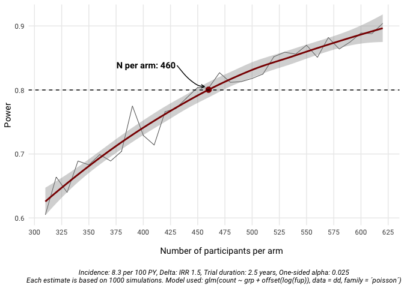

Non-Inferiority Trial Sample Size Calculation
================
Bernard Surial
2024-12-22

### Introduction

This is a simulation to calculate the sample size needed for my SNSF
Starting Grant application **Optimizing Screening for Chlamydia and Gonorrhea:** Toward Effective Prevention and Antibiotic Stewardship.

I use the following assumptions based on estimates of the Swiss HIV
Cohort Study data.

- **Study duration:** 2.5 years
- **Incidence rate of symptomatic chlamydia or gonorrhea:** 8.3 per 100
  person-years
- **Non-inferiority margin (on an Incidence rate ratio \[IRR\] scale):**
  1.5
- **Power:** 80%
- **One-sided alpha:** 0.025

``` r
#create cluster
library(future.apply)
```

    ## Loading required package: future

``` r
library(simstudy)
library(tidyverse)
```

    ## ── Attaching core tidyverse packages ──────────────────────── tidyverse 2.0.0 ──
    ## ✔ dplyr     1.1.4     ✔ readr     2.1.4
    ## ✔ forcats   1.0.0     ✔ stringr   1.5.1
    ## ✔ ggplot2   3.4.4     ✔ tibble    3.2.1
    ## ✔ lubridate 1.9.3     ✔ tidyr     1.3.1
    ## ✔ purrr     1.0.2

    ## ── Conflicts ────────────────────────────────────────── tidyverse_conflicts() ──
    ## ✖ dplyr::filter() masks stats::filter()
    ## ✖ dplyr::lag()    masks stats::lag()
    ## ℹ Use the conflicted package (<http://conflicted.r-lib.org/>) to force all conflicts to become errors

``` r
library(broom)
plan(multisession, workers = 11)


n_sim = 1000          # Number of simulations for each power estimate
fup_time = 2.5        # Mean study duration per participant in years
incidence = 8.3/100   # Incidence rate per 100 person-years
n_arm = 500           # Number of participants per arm
delta = 1.5           # Non-inferiority margin, on IRR scale
beta = 0.2

# Generate dataset
simit <- function(fup_time, incidence, n_arm, delta) {
  # Create follow-up variable
  def <- defData(varname = "fup", formula = fup_time, dist = "normal") 
  
  # Create incidence variable 
  def <- defData(def, varname = "inc", formula = incidence, dist = "normal")
  
  # Create count variable
  def <- defData(def, varname = "count", formula = "fup*inc", dist = "poisson")
  
  # Create dataset
  dd <- genData(n_arm * 2, def)
  
  # Create treatemnt groups (n = 2)
  dd <- trtAssign(dd, nTrt = 2, grpName = "grp", balanced = TRUE)
  
  # Fit Poisson model
  m <- glm(count ~ grp + offset(log(fup)), data = dd, family = "poisson")
  
  # Extract coefficients
  coefs <- summary(m)$coefficients
  
  # Check if the upper limit of the 95% CI is below the non-inferiority margin
  exp(coefs[2,1] + 1.96 * coefs[2,2]) < delta
}


# Calculate some power estimates, stop at 90% power (1 - beta)
i <- 1                 # Index for dataframe
pwr <- c()             # Vector to store power estimates
ns <- c()              # Vector to store number of participants per arm
n_per_arm <- 300       # Initial number of participants per arm
beta <- 0.1            # Beta to stop the simulation

power <- mean(future_replicate(n_sim, simit(fup_time, incidence, n_per_arm, delta)))

while (power < (1 - beta)) {
  n_per_arm <- n_per_arm + 10
  power <- mean(future_replicate(n_sim, simit(fup_time, incidence, n_per_arm, delta)))
  list(n_per_arm, power)
  cat("Power with", n_per_arm * 2, "participants:", power, "\n")
  pwr[i] <- c(power)
  ns[i] <- c(n_per_arm)
  i <- i + 1
}
```

    ## Power with 620 participants: 0.605 
    ## Power with 640 participants: 0.664 
    ## Power with 660 participants: 0.64 
    ## Power with 680 participants: 0.689 
    ## Power with 700 participants: 0.683 
    ## Power with 720 participants: 0.699 
    ## Power with 740 participants: 0.689 
    ## Power with 760 participants: 0.704 
    ## Power with 780 participants: 0.775 
    ## Power with 800 participants: 0.729 
    ## Power with 820 participants: 0.714 
    ## Power with 840 participants: 0.766 
    ## Power with 860 participants: 0.771 
    ## Power with 880 participants: 0.788 
    ## Power with 900 participants: 0.804 
    ## Power with 920 participants: 0.803 
    ## Power with 940 participants: 0.827 
    ## Power with 960 participants: 0.812 
    ## Power with 980 participants: 0.813 
    ## Power with 1000 participants: 0.818 
    ## Power with 1020 participants: 0.825 
    ## Power with 1040 participants: 0.852 
    ## Power with 1060 participants: 0.859 
    ## Power with 1080 participants: 0.856 
    ## Power with 1100 participants: 0.87 
    ## Power with 1120 participants: 0.851 
    ## Power with 1140 participants: 0.882 
    ## Power with 1160 participants: 0.864 
    ## Power with 1180 participants: 0.875 
    ## Power with 1200 participants: 0.889 
    ## Power with 1220 participants: 0.888 
    ## Power with 1240 participants: 0.904

``` r
samplesize_calculated <- tibble(pwr, ns)
# write_rds(samplesize_calculated, "01-samplesize_calculated.rds")

# Use a loess model to get an estimate of the smoother that is closest to 80%
mod <- loess(pwr ~ ns, data = samplesize_calculated, span = 0.75)
new_ns <- tibble(ns = 300:700)
new_ns$p <- predict(mod, newdata = new_ns, type = "response")

p0.8 <- new_ns |> 
  filter(p>=0.8) |> 
  slice(1)

# Generate graph
tibble(pwr, ns) |> 
  ggplot(aes(x = ns, y = pwr)) + 
  geom_line(linewidth = 0.25) + 
  geom_smooth(color = "darkred", span = 0.75) + 
  geom_point(aes(x = ns, y = p), color = "darkred", data = p0.8, size = 3) +
  ggrepel::geom_text_repel(aes(label = glue::glue("N per arm: {ns}"), x = ns, y = p), data = p0.8, 
                           nudge_x = -25, nudge_y = 0.05, segment.curvature = 0.1, 
                           point.padding = 1,
                           box.padding = 5,
                           arrow = arrow(length = unit(0.015, "npc")), 
                           family = "Roboto", fontface = "bold") +
  geom_hline(yintercept = 0.80, linetype = "dashed") + 
  scale_x_continuous(breaks = seq(300, 1000, 25)) +
  labs(x = "
       Number of participants per arm
       ", y = "Power", 
       caption =glue::glue("
                           Incidence: {incidence*100} per 100 PY, Delta: IRR {delta}, Trial duration: {fup_time} years, One-sided alpha: 0.025
                           Each estimate is based on {n_sim} simulations. Model used: glm(count ~ grp + offset(log(fup)), data = dd, family = ´poisson´)")) + 
  theme_minimal(base_family = "Roboto") + 
  theme(plot.caption = element_text(hjust = 0.5, 
                                    face = "italic"), 
        panel.grid.minor.x = element_blank(), 
        panel.grid.minor.y = element_blank())
```

    ## `geom_smooth()` using method = 'loess' and formula = 'y ~ x'

<!-- -->

``` r
# Write out the graph
ggsave("snf-sample-simulation.png", 
       width = 8, height = 6, dpi = 300, bg = "white")
```

    ## `geom_smooth()` using method = 'loess' and formula = 'y ~ x'
